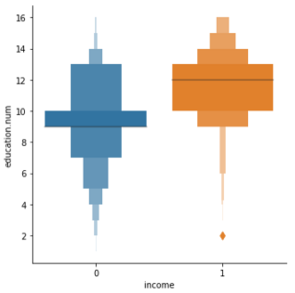

# 📈 Análise e Predição - Dataset Adult

#### Limpeza, Visualização, Análise e Predição do Dataset Adult, utilizando o classificador k-Nearest Neighbors.

- ### [👨‍💻 Notebook](Notebook.ipynb)

Projeto desenvolvido para a disciplina PMR3508 - Aprendizado de Máquina e Reconhecimento de Padrões.